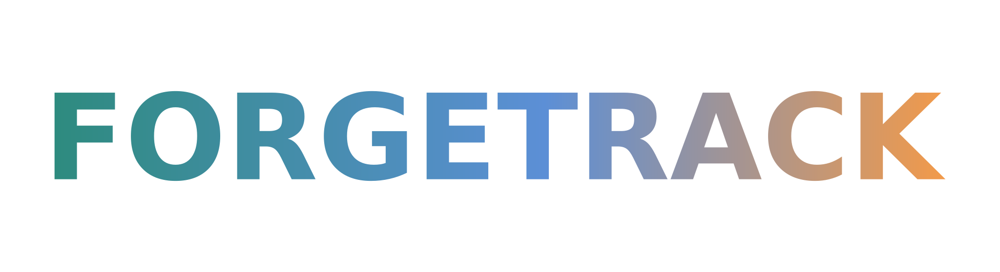

<!-- markdownlint-disable MD033 MD041 -->
<p align="center">
  
</p>

<p align="center">
  <b>Fitness tracker s RPG progresí — Android, Health Connect, Google Sheets export.</b>
</p>

<p align="center">
  <a href="#features">Features</a> ·
  <a href="#architecture">Architecture</a> ·
  <a href="#getting-started">Getting started</a> ·
  <a href="#documentation">Documentation</a> ·
  <a href="#project-structure">Structure</a>
</p>

---

Forgetrack reads your fitness and nutrition data from existing trackers,
turns it into XP, quests, achievements and a cosmetic loadout — and
keeps a clean Google Sheets log for you (or your coach).

The app is **Android-only** because it sits on top of
[Health Connect](https://developer.android.com/health-and-fitness/guides/health-connect)
as the source of truth for steps, sleep, weight and activity data.
Built with Flutter, fully localized in **Czech and English**.

## Features

### Data sources

- **Health Connect** — steps, calories, sleep, body weight, workouts.
  Range refresh with quota-aware caching; permissions managed through
  the platform dialog.
- **[Kalorické tabulky](https://www.kaloricketabulky.cz)** — daily
  calorie and macro logging via the third-party REST API. Cookie-based
  session with credentials stored in Android Keystore.

### Progression — the RPG layer

- **Append-only event ledger** — every reward, claim, node completion,
  and daily-section offering is an immutable event with a
  deterministic key. Replayable, idempotent, and audit-friendly.
- **Catalog-driven content** — 11 chapters with storyline quests, daily
  & weekly objectives, combo chains, long-term goals, level milestones
  (1 to 100), achievements, and side-quests. All compile-time Dart, so
  the validator catches drift before release.
- **Cosmetic loadout** — frames, relics, backgrounds, emblems and
  companions earned via achievements + compound rules
  (`level ≥ N AND owns relic_X AND owns relic_Y`).
- **Emblem XP buffs** — emblems pinned into your `EmblemBoard`
  contribute a percent XP bonus per claim. Per-target buffs match a
  specific daily goal or combo quest; the mythic blanket emblem adds a
  smaller bonus to every target the catalog covers. Companion and
  emblem percents stack additively into a single multiplier — no daily
  cap. Pre-claim projection shows the bonus in the XP pill; the
  granted bonus is persisted on the journal event and surfaced in the
  reward toast.
- **Journey map + celebrations** — pannable level-spine map and
  fullscreen celebration scenes for reward claims.
- **Retroactive claim window** — forgot to tap claim? Backfill section
  in the quests screen lets you reach 7 days back for daily goals,
  daily quests, and individual workouts. Granted XP is frozen at
  claim time, so a level-up never retroactively changes a past pill.
  Daily challenge slot rotates only across midnight with a 2-day
  anti-repeat cooldown to keep the daily pool varied.

### Sync & export

- **Raw Sheets export** — full DB dump with merge-by-date semantics for
  personal analysis.
- **Coach Log (Bushido) export** — idempotent weekly coaching report
  with ISO-week blocks, marker-based lookup, and protected manual
  cells.

### Social

- **Friends, leaderboard, profile snapshot** — Firestore-backed, FCM
  push notifications for friend requests and achievement shares.
- **Achievement sharing** — per-user snapshot with localized fallback
  for cross-version robustness.

### Cloud sync

- **Local-first** — Isar writes are synchronous; cloud push is
  fire-and-forget. Offline works.
- **Write-through Firestore** — V2 progression ledger mirrors every
  accepted event into per-user subcollections under `users/{uid}/`.
- **Pull-and-merge on login** — fresh installs and second devices
  recover the full progress history.

## Tech stack

| Layer | Choice |
|---|---|
| Framework | Flutter 3.x (Dart SDK `^3.5.0`) |
| Platform | Android only (`minSdk 26`, Health Connect requirement) |
| State management | `provider` 6.x with `ChangeNotifierProxyProvider*` |
| Local storage | Isar 3.1 (4 databases: health, nutrition, progression, cosmetics) |
| Cloud | Firebase (Auth, Firestore, FCM, Storage) |
| Auth | Google Sign-In → Firebase Auth |
| Charts | `fl_chart` |
| Exports | Google Sheets API v4 via `googleapis` |
| Background | Android WorkManager |
| Push | Firebase Cloud Messaging |
| Localization | `flutter_localizations` + `gen_l10n` (cs / en) |

## Architecture

Hybrid layering: cross-aggregate domain types in `lib/domain/`,
feature-first composition for everything else.

```text
lib/
├── core/                 # logging, services, navigation, errors (AppError + Result)
├── shared/               # design tokens, formatters, reusable widgets
├── domain/               # cross-aggregate pure-Dart domain layer
│   ├── journal/          # JournalEvent + JournalProjection + EventKey / PeriodKey
│   ├── player/           # Player aggregate root + LevelCurve
│   └── progression/      # catalog ids + per-aggregate sealed lifecycles + read projections
├── features/<feature>/
│   ├── domain/           # feature-internal entities, value objects, sealed types
│   ├── data/             # repositories, API adapters, Isar / Firestore
│   ├── application/      # providers, orchestration, use-cases
│   └── presentation/     # screens, widgets, navigation
├── l10n/                 # ARB files (cs, en) + generated localizations
└── main.dart             # DI graph (MultiProvider + ChangeNotifierProxyProvider*)
```

Hard rules: `shared/` must not import `features/*`, `application/` must
not import `presentation/`, `domain/` (both top-level and feature) stays
pure (no Flutter, no I/O) — enforced by
[`test/domain_purity_test.dart`](test/domain_purity_test.dart) + Phase 21
ratchet lints. See [`docs/architecture.md`](docs/architecture.md) for the
full layering contract, feature index, and the domain layer convention
(sealed catalog rows + sealed lifecycles + read projections).

For an **interactive view** of the architecture (feature map, provider
DI graph, data flows, storage layout, RPG layer, ADRs), open
[`docs/site/`](docs/site/) — see [Documentation](#documentation).

## Getting started

### Prerequisites

- Flutter SDK 3.x (Dart `^3.5.0`)
- Android Studio or Android command-line tools
- A physical Android device or emulator running **API 26+** with
  Health Connect installed
- A Firebase project (for cloud features) — `lib/firebase_options.dart`
  is consumed but not checked in by default; generate via
  `flutterfire configure`
- Google Cloud OAuth client for Sheets API access

### Install & run

```bash
flutter pub get
flutter pub run build_runner build --delete-conflicting-outputs   # generates Isar .g.dart
flutter run --flavor dev --dart-define=FLAVOR=dev
```

The first launch walks you through onboarding: Health Connect
permissions → Google Sign-In → optional Kalorické tabulky login.

### Build flavors

Two product flavors are wired in [`android/app/build.gradle.kts`](android/app/build.gradle.kts):

| Flavor | applicationId | Launcher label | DevTools access |
|---|---|---|---|
| `dev` | `com.knejp.forgetrack.dev` | "Forgetrack DEV" (orange icon background) | always allowed |
| `prod` | `com.knejp.forgetrack` | "Forgetrack" | requires UID in `DevToolsPermissionService._developerUids` |

Both can be installed side-by-side on the same device — their data
(Isar / SharedPreferences / Health Connect grants) is fully isolated
by package name. Each registers as a separate Firebase Android app in
the `forgetracker-493415` project.

```bash
# Dev build (default), debug debugger session
flutter run --flavor dev --dart-define=FLAVOR=dev

# Prod build, profile mode for performance sanity checks
flutter run --flavor prod --dart-define=FLAVOR=prod --profile
```

Always pair `--flavor` with `--dart-define=FLAVOR=<same>`. The Gradle
flavor selects the applicationId + Firebase app + launcher resources;
`--dart-define=FLAVOR` flips runtime checks in
[`lib/core/build_config.dart`](lib/core/build_config.dart). They
must match.

### Build a release APK

```bash
flutter build apk --release --flavor prod --dart-define=FLAVOR=prod
```

This produces a `prod`-signed APK at
`build/app/outputs/flutter-apk/app-prod-release.apk`. Release signing
loads `android/key.properties` (gitignored) — see
[docs/release/beta_readiness.md](docs/release/beta_readiness.md) for
the keystore setup. On a fresh checkout without `key.properties` the
release build falls back to the debug keystore, so the file simply
not existing is not a build error.

## Project structure

```text
.
├── android/                  # Android Gradle project, manifests, signing
├── assets/                   # Branding, icons, UI art, cosmetic frames
├── docs/                     # Architecture, plans, integrations, site/
│   ├── architecture.md
│   ├── PLAN.md
│   ├── progression_engine/   # V2 engine plan + session handoff
│   ├── features/             # Per-feature design docs
│   ├── integrations/         # Captured API references
│   └── site/                 # Interactive architecture web (vanilla HTML)
├── lib/                      # Flutter source (417 .dart files)
├── test/                     # Unit + widget tests (35 files)
├── tooling/                  # Audit & branding asset scripts
├── CLAUDE.md                 # Working agreements for Claude Code sessions
└── pubspec.yaml
```

## Documentation

| Document | What you'll find |
|---|---|
| [`docs/architecture.md`](docs/architecture.md) | Directory layout, dependency rules, design tokens, Health Connect / KT / progression invariants |
| [`docs/site/`](docs/site/) | Interactive architecture web — feature map, provider graph (Cytoscape), data flows (Mermaid sequence), storage map, integrations, glossary (sealed hierarchies), RPG layer flowchart, ADRs |
| [`docs/progression_engine/`](docs/progression_engine/) | V2 engine phased plan + session handoff |
| [`docs/features/`](docs/features/) | Coach Log export design, Firestore sync wire format |
| [`docs/integrations/`](docs/integrations/) | Captured external API references (Kalorické tabulky) |
| `lib/features/<feature>/README.md` | Per-feature documentation where it exists |
| [`CLAUDE.md`](CLAUDE.md) | Working agreements + maintenance pointers for AI-assisted sessions |

### Running the interactive architecture docs locally

```bash
python -m http.server 8000 --directory docs/site
# then open http://localhost:8000/
```

The site is also wired up for **GitHub Pages** deployment via
[`.github/workflows/pages.yml`](.github/workflows/pages.yml) — manual
trigger from the Actions tab once Pages is enabled in repo Settings.

## Development workflow

### Verification after changes

- `flutter analyze` — clean (pre-existing Isar `.g.dart` warnings are
  accepted)
- `flutter test test/features/<area>/` — for the area you touched
- For UI work: run on a real device, exercise the golden path and edge
  cases in a browser-style review

### Localization

Strings live in `lib/l10n/app_en.arb` and `lib/l10n/app_cs.arb`. After
editing either file, run:

```bash
flutter gen-l10n
```

Catalog entries use closure-based localization
(`name: (l10n) => l10n.cosmeticXxxName`) — missing ARB keys break the
build, never the runtime.

### Logging

Use `AppLog` from `lib/core/logging/app_log.dart` for sync, reset,
export, progression and cosmetic events. `print()` is forbidden.

### Background sync & devtools

WorkManager schedules a periodic background refresh of Health Connect
and Kalorické tabulky data. DevTools (gated behind `kDebugMode` + a
developer UID allowlist) exposes factory reset, day-offset advance for
progression testing, and provider state inspection.

## Branding

Project branding lives in [`assets/branding/`](assets/branding/):

- `app-icon.png` — launcher and compact brand-mark
- `wordmark-dark.svg` / `wordmark-light.svg` — for light / dark backgrounds
- `wordmark-gradient.svg` — for README and marketing

When the logo changes, regenerate the platform asset derivatives:

```powershell
./tooling/generate_branding_assets.ps1
```

## Status

Forgetrack is **personal-use software** under active development. There
are no public users yet, so the app may be reset during development and
no schema migrations are written until needed.

The doménový refactor (22 phases, May 17–19 2026) finished on branch
`refactor/domain-model-design` and landed the canonical RPG domain model:
`Player` aggregate root, sealed per-aggregate lifecycles
(`PlayerQuestLifecycle`, `PlayerAchievementLifecycle`,
`PlayerCosmeticLifecycle`, `ChapterLifecycle`), `JournalEvent` /
`JournalProjection<T>`, `Result<T, AppError>` for typed sync errors, and
the legacy V1 progression module deletion. See
[`docs/domain_model/`](docs/domain_model/) for the proposal (target
model), the archived migration plan, and the structured next-round
follow-ups.

The V2 progression engine is now the only progression workstream — see
[`docs/progression_engine/`](docs/progression_engine/) for engine-specific
notes. The Track A close-out round (R.1–R.8) shipped 2026-05-19; the
archived plan lives at
[`docs/domain_model/archive/follow_ups.md`](docs/domain_model/archive/follow_ups.md)
alongside `migration_plan.md`.
