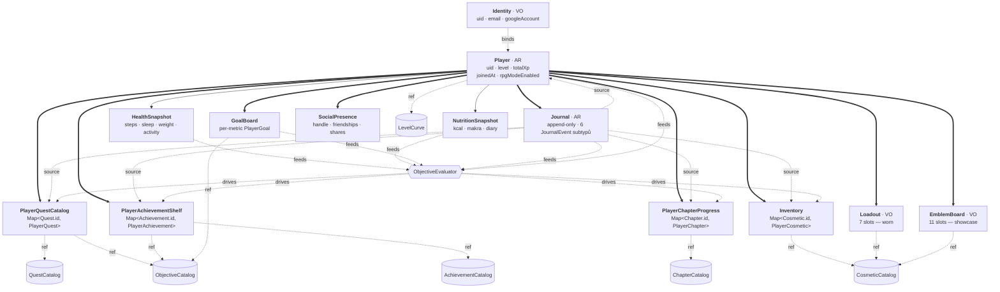
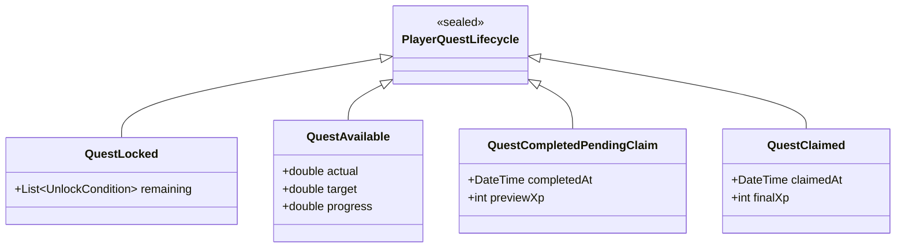
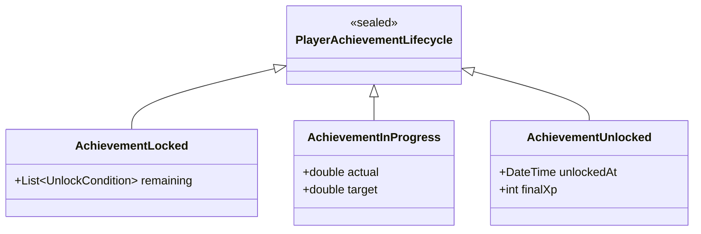
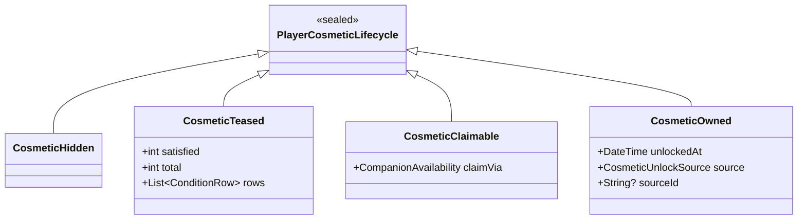
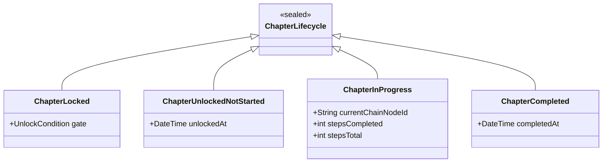

# Forgetrack — Domain Model Proposal

**Status:** Návrh k odsouhlasení. Definuje doménový model celé appky **konceptuálně** — bez produkčního kódu, bez phase plánu a bez file-level edit listu.
**Created:** 2026-05-17
**Companion docs:** [session_handoff.md](session_handoff.md) (brief, kontext, fragmentation map).
**Next:** odsouhlasený proposal → samostatná session pro fázovaný migration plán → další session pro code edits.

> Tento dokument je **návrh**. Žádný kód v repu se zatím nemění. Žádné persistence schemata se zatím nemění. Cílem je doménově popsat *co* a *jak se to jmenuje*, nikoli *jak se k tomu dostaneme*.

---

## 0. TL;DR — rozhodnutí v 30 sekundách

| Rozhodnutí | Volba |
|---|---|
| **Aggregate root** | `Player` (single-player app — žádný explicit `Context`). |
| **Catalog ↔ Instance pattern** | `Quest` (catalog, sealed) ↔ `PlayerQuest` (instance, sealed lifecycle); `Cosmetic` ↔ `PlayerCosmetic`; `Achievement` ↔ `PlayerAchievement`; `Chapter` ↔ `PlayerChapter`. Container symetrie: `QuestCatalog` ↔ `PlayerQuestCatalog`. |
| **Catalog umbrella** | Sealed `ProgressionEntry` ← `Quest` (sealed) / `Achievement` / `Milestone` / `LevelMilestone` / `ChapterCompletion` / `CompanionAvailability` / `Relic` / `ContentUnlock`. |
| **Naming sjednoceno** | Drop `Definition` / `Node` suffix u všech catalog typů. `Cosmetic` → `Cosmetic`, `QuestNode` → `Quest`, `Objective` → `Objective`, `ProgressionNode` → `ProgressionEntry`. |
| **Folder layout** | Hybrid: `lib/domain/` pro cross-aggregate typy, `lib/features/<f>/domain/` pro feature-internal. |
| **Code-gen** | Žádný. Hand-written `const` + `==`/`hashCode`. Sealed unions s native Dart 3 switch. |
| **Player level/XP** | Field na `Player`, nikoli engine input. Engine ho čte z Player, ne naopak. |
| **History** | `Journal` aggregate (přejmenovaný ledger). Iterable query API, ne eager list. |
| **RPG mode off** | View-layer filter; `Player.rpgModeEnabled` + `ActivationPolicy` rozhodují. Doménové struktury jsou identické. |
| **Localization** | `LocalizedText = String Function(AppLocalizations)` closures **zůstávají v catalogu**. Instance entity (`PlayerQuest`...) nesou jen `id` reference. |
| **Repository** | Per-aggregate doménové interface (`PlayerRepository`, `JournalRepository`, `InventoryRepository`). Fáze 1 = adaptery nad existujícími repository, žádná persistence-schema změna. |

---

## 1. Klasifikace všech feature

Pro každou složku v `lib/features/` klasifikace: **domain-relevant** (produkuje / vlastní doménové entity), **UI-shell** (jen drží navigaci / layout), **export** (transformuje doménu pro externí konzum).

| Feature | Kategorie | Doménové entity, které vlastní / produkuje |
|---|---|---|
| `auth/` | **domain-relevant** | `Identity` (renamed `AuthUser`) — vrstva nad Firebase Auth + Google Sign-In. |
| `health_connect/` | **domain-relevant** | `HealthSnapshot` (steps / sleep / weight / activity) — read-only mirror externího source-of-truth. |
| `nutrition/` | **domain-relevant** | `NutritionSnapshot` (kcal / makra / KT diary), `KTCredentials`. |
| `progression_engine/` | **domain-relevant** | Catalog: `ProgressionEntry` hierarchie + `Objective`. Read-side: `Player.level`, `Player.totalXp`, `PlayerQuestCatalog`, `PlayerAchievementShelf`, `PlayerChapterProgress`. Engine sám (objective evaluator, node resolver, reward planner) zůstává `application/` infrastruktura. |
| `progression/` (V1) | **legacy — delete-candidate** | Žádné nové domain entity. Žije jen v `background_sync_service` + devtools + 5 testů. Proposal ji označuje jako "to be removed" — fyzický cleanup je práce next-next session. |
| `cosmetics/` | **domain-relevant** | Catalog: `Cosmetic` (sealed: `Frame` / `Background` / `Companion` / `Relic` / `Emblem` / `TitleFlair` / `MapEffect`). Player-side: `PlayerCosmetic`, `Inventory`, `Loadout`. |
| `social/` | **domain-relevant** | `SocialPresence` aggregate: `Handle`, `Friendship`, `FriendRequest`, `AchievementShare`, `SocialNotification`. **`SocialUserProfile` je read model**, ne aggregate — viz §5. **`PinnedEmblems`** (11-slotový profile-header showcase) je separátní Player-side koncept — viz §2.4. |
| `journey/` | **UI-shell** | `JourneyCheckpoint`, `JourneyEventType` jsou **view-only derivace** z Journal eventů + LevelMilestone catalog. Zůstávají v presentation/journey, nestávají se doménou. |
| `celebration/` | **UI-shell** | `CelebrationEvent`, `CelebrationReward`, `CelebrationType` jsou **view-only payload**, ne doménová entita. Producer = progression engine adapter, consumer = overlay. |
| `home/` | **UI-shell** | Žádná doména. `HomeCardOrder` je UX preference (SharedPreferences). |
| `app_shell/` | **UI-shell** | Žádná doména. |
| `settings/` | **UI-shell** | Žádná doména. |
| `onboarding/` | **UI-shell** | `OnboardingStep` enum + persistence. UX-only. |
| `devtools/` | **UI-shell** (debug) | Žádná doména. May import anything per `architecture.md`. |
| `coach_log_export/` | **export** | `BushidoWeekReport`, `BushidoDayRow`, `IsoWeek`. View modely pro export, ne doména. |
| `sheets_export/` | **export** | `SheetExportField` config catalog + raw row builders. Konfigy pro pipeline, ne doména. |

### 1.1 Domain layer leaks found during verification

Tři smell items, které **proposal nezavazuje opravit teď**, ale měly by být známé. Tyto leaky **neobsahují** žádné chybějící doménové entity — jsou to architekturální smely v existujícím kódu, které zaslouží zmínku.

1. **`lib/features/sheets_export/domain/sheet_export_field.dart` importuje providery** (`FitnessProvider`, `KalorickeTabulkyProvider`) přímo. Architecture rule §3 (`domain/` stays pure — žádné Provider / I/O importy) je porušen. `SheetExportField.resolve` closure čte data přímo z providerů. **Doporučení (out of scope této session):** přesunout soubor do `application/` nebo refaktorovat `resolve` na `(date, FitnessSnapshot, NutritionSnapshot) → Object?`.

2. **`lib/features/coach_log_export/domain/bushido_export_config.dart` má hardcoded české labely.** `BushidoColumn.weightKg(label: 'Váha', ...)`, `BushidoTargetMetric.kcal(label: 'Kcal', ...)` — bypass `AppLocalizations`. Export do třetí strany (Google Sheets) jde v jednom jazyce, doctrine §8 (l10n closures v doméně) zde **přijatelně neaplikuje** jako vědomá výjimka, ne přehlédnutí.

3. **`lib/features/health_connect/domain/activity_record.dart` + `steps_record.dart` carry `toSheetRow()`.** Export concern v doménové entitě — duplikuje §7 anti-pattern č. 10.

**Důsledky pro umístění:**
- **Domain-relevant** typy, které jsou **cross-feature** (Player, Journal, lifecycly, LevelCurve) → `lib/domain/`.
- **Domain-relevant** typy, které jsou **feature-internal** (KTCredentials, HealthSnapshot, NutritionSnapshot, SocialPresence sub-entity) → zůstávají v `lib/features/<f>/domain/`.
- **UI-shell / export** typy → zůstávají kde jsou. Nepatří do `lib/domain/`.

---

## 2. Doménový glosář

Každá "věc" v appce klasifikovaná podle DDD slovníku. **AR** = Aggregate Root, **E** = Entity (uvnitř aggregate), **VO** = Value Object, **CAT** = Catalog Definition (immutable static), **RM** = Read Model (transient view).

### 2.1 Player aggregate

| Symbol | Typ | Žije v | Popis |
|---|---|---|---|
| `Player` | **AR** | `lib/domain/player/` | Root single-player aggregate. Drží: `uid`, `level`, `totalXp`, `joinedAt`, `rpgModeEnabled`, `displayName`, `photoUrl`. |
| `Identity` | **VO** | `lib/features/auth/domain/` | Renamed `AuthUser`. Firebase + Google identity tuple. Bridge mezi providerem `AuthProvider` a `Player`. |
| `LevelCurve` | **VO** | `lib/domain/player/` | XP-to-level policy (dnes `level_policy.dart`). Read-only function `int levelFor(int totalXp)` + `int xpForNextLevel(int level)`. |

### 2.2 Journal aggregate (event-sourced history)

| Symbol | Typ | Žije v | Popis |
|---|---|---|---|
| `Journal` | **AR** | `lib/domain/journal/` | Append-only event log. Owns `Iterable<JournalEvent>` query API. Source-of-truth pro level / XP / unlocks. |
| `JournalEvent` | **sealed VO** | `lib/domain/journal/` | Renamed `LedgerEvent`. 6 subtypů (`ObjectiveCompletion` / `NodeCompletion` / `NodeAnnouncement` / `NodeClaim` / `RewardGrant` / `QuestOffered`). |
| `EventKey` | **VO** | `lib/domain/journal/` | Deterministic dedupe ID — extracted from inline string into typed value object. |
| `PeriodKey` | **VO** | `lib/domain/journal/` | `yyyy-MM-dd` / ISO week / `chapter:id` / `lifetime`. Already structured via `ObjectiveScope`; explicit VO for clarity. |

### 2.3 Catalog umbrella

| Symbol | Typ | Žije v | Popis |
|---|---|---|---|
| `ProgressionEntry` | **sealed CAT** | `lib/domain/progression/catalog/` | Renamed `ProgressionNode`. Sealed umbrella všech progression catalog rows. |
| `Quest` | **sealed CAT** (child) | `lib/domain/progression/catalog/` | Renamed `QuestNode`. Sealed sub-hierarchy: `DailyQuest`, `WeeklyQuest`, `DailyChallenge`, `LongTermQuest`, `ChapterOpener`, `ChapterStep`, `ChapterFinale`, `ChapterSideQuest`, `ComboStep`, `ComboFinale`. |
| `Achievement` | **CAT** (child) | `lib/domain/progression/catalog/` | Renamed `Achievement`. |
| `Milestone` | **CAT** (child) | `lib/domain/progression/catalog/` | Renamed `Milestone`. |
| `LevelMilestone` | **CAT** (child) | `lib/domain/progression/catalog/` | Renamed `LevelMilestone`. XP-threshold gate. |
| `ChapterCompletion` | **CAT** (child) | `lib/domain/progression/catalog/` | Renamed `ChapterCompletion`. Marks "kapitola X dokončena". |
| `CompanionAvailability` | **CAT** (child) | `lib/domain/progression/catalog/` | Renamed `CompanionAvailability`. Manual-claim gate pro odemčení Companion `Cosmetic`. |
| `Relic` | **CAT** (child) | `lib/domain/progression/catalog/` | Renamed `Relic`. |
| `ContentUnlock` | **CAT** (child) | `lib/domain/progression/catalog/` | Renamed `ContentUnlock`. |
| `Objective` | **CAT** | `lib/domain/progression/catalog/` | Renamed `Objective`. Co se měří + scope. |
| `ObjectiveMetric` | **sealed VO** | `lib/domain/progression/catalog/` | 20+ metrik. Beze změny. |
| `ObjectiveScope` | **sealed VO** | `lib/domain/progression/catalog/` | Time window. Beze změny. |
| `UnlockCondition` | **sealed VO** | `lib/domain/progression/catalog/` | 11 subtypů včetně `AllOf` / `AnyOf`. Beze změny. |
| `RewardDefinition` | **sealed VO** | `lib/domain/progression/catalog/` | 8 subtypů. **Suffix `Definition` výjimečně zůstává**, protože `Reward` jako noun by kolidoval s `RewardGrantEvent` na ledger úrovni. |
| `ClaimPolicy` / `ActivationPolicy` / `CelebrationPolicy` / `GatePolicy` / `SlotPolicy` / `ProgressStartPolicy` | enum / sealed VO | `lib/domain/progression/catalog/` | Beze změny. |
| `Chapter` | **CAT** | `lib/domain/progression/catalog/` | Aggregating type — chapter id, title, ordered chain (`ChapterOpener` → `ChapterStep`...n → `ChapterFinale`), side-quests, `ChapterCompletion` reference. Dnes implicitně rozprostřeno přes `chapter_*_content.dart` literály — proposal navrhuje explicit catalog wrapper. |
| `Cosmetic` | **CAT** | `lib/features/cosmetics/domain/` | Renamed `Cosmetic`. Sealed sub-hierarchie pro 7 typů (`Frame`, `Background`, `Companion`, `RelicCosmetic` *(disambiguated)*, `Emblem`, `TitleFlair`, `MapEffect`). Lokace zůstává ve feature, dokud cosmetics zůstávají self-contained. |
| `Rarity` | enum | `lib/shared/domain/` | Beze změny. |

> Pojmenování `RelicCosmetic` *(vs. `Relic` catalog node)*: dnes je dvojí "Relic" — `Relic` (progression catalog) a `Cosmetic` typu `relic` (cosmetics catalog). Návrh: progression catalog drží `Relic` (gating node), cosmetics catalog drží `RelicCosmetic` (visual asset). Reference je 1:1 přes `cosmeticId`, ale typy jsou semantically různé.

### 2.4 Player-side per-type collections

| Symbol | Typ | Žije v | Popis |
|---|---|---|---|
| `PlayerQuest` | **E** | `lib/domain/progression/player/` | `Quest` reference + `PlayerQuestLifecycle` (sealed). |
| `PlayerQuestCatalog` | **E** (collection) | `lib/domain/progression/player/` | Per-Player map `Quest.id → PlayerQuest`. Read-only view derived z Journal + Objective outcomes. |
| `PlayerAchievement` | **E** | `lib/domain/progression/player/` | `Achievement` reference + `PlayerAchievementLifecycle` (sealed). |
| `PlayerAchievementShelf` | **E** (collection) | `lib/domain/progression/player/` | Per-Player map `Achievement.id → PlayerAchievement`. |
| `PlayerChapter` | **E** | `lib/domain/progression/player/` | `Chapter` reference + `ChapterLifecycle` (sealed). |
| `PlayerChapterProgress` | **E** (collection) | `lib/domain/progression/player/` | Per-Player map `Chapter.id → PlayerChapter`. |
| `PlayerCosmetic` | **E** | `lib/features/cosmetics/domain/` | `Cosmetic` reference + `PlayerCosmeticLifecycle` (sealed). |
| `Inventory` | **E** (collection) | `lib/features/cosmetics/domain/` | Per-Player map `Cosmetic.id → PlayerCosmetic`. Substitute za dnešní `UserCosmeticsState.unlocked`. |
| `Loadout` | **VO** | `lib/features/cosmetics/domain/` | Renamed `EquippedCosmetics`. Per-slot `Cosmetic.id?`. Synchronizováno do Firestore profile (1 emblem viditelný přátelům). |
| `EmblemBoard` | **VO** | `lib/features/cosmetics/domain/` | 11-slotový pinned-emblem grid pro profile header (4+4+3 layout). Per-device persistence (`pinned_emblems_{uid}` v SharedPreferences). Liší se od `Loadout.emblemId` tím, že je to **public showcase** (collection view), ne worn item. Dnes implementováno v `lib/features/social/application/pinned_emblems_store.dart` — relokace patří do cosmetics domain, protože sémanticky je to cosmetic-collection concept, ne social one. |
| `GoalBoard` | **E** | `lib/features/health_connect/domain/` | Per-Player goals (steps / kcal / makra / sleep / weight). Persistence zůstává `SharedPreferences` (per-device, viz handoff §4). |
| `PlayerGoal` | **VO** | `lib/features/health_connect/domain/` | Single goal: metric + target + history (revisions). |

### 2.5 Sealed lifecycles (player-side state)

Každý lifecycle nahrazuje sadu booleanů nebo paralelní enumy. **Compiler vynucuje exhaustive switch** v UI a aplikační vrstvě.

| Lifecycle | Stavy | Co dnes nahrazuje |
|---|---|---|
| `PlayerQuestLifecycle` | `QuestLocked(remaining)` / `QuestAvailable(actual, target, progress)` / `QuestCompletedPendingClaim(completedAt, previewXp)` / `QuestClaimed(claimedAt, finalXp)` | `NodeState` enum (3 hodnoty) + ad-hoc `isAvailableForClaim`, `previewXp`, `isClaimed` boolean rozházené po providerech. |
| `PlayerAchievementLifecycle` | `AchievementLocked(remaining)` / `AchievementInProgress(actual, target)` / `AchievementUnlocked(unlockedAt, finalXp)` | `NodeState` + denormalizovaný `SocialUnlockedAchievement.unlockedAt`. |
| `PlayerCosmeticLifecycle` | `CosmeticHidden` / `CosmeticTeased(satisfied, total, rows)` / `CosmeticClaimable(claimVia?)` / `CosmeticOwned(unlockedAt, source, sourceId)` | `CosmeticRevealState` enum (4) **paralelně s** `CompanionState` enum (4) **paralelně s** `UnlockedCosmetic` map. 3 lifecycly → 1. |
| `ChapterLifecycle` | `ChapterLocked(gate)` / `ChapterUnlockedNotStarted(unlockedAt)` / `ChapterInProgress(currentChainNodeId, stepsCompleted, stepsTotal)` / `ChapterCompleted(completedAt)` | Dnes implicitní — chapter state derivován z `ChapterUnlocked` UnlockCondition + `ChapterCompletion` `NodeState`. Explicitní lifecycle ukázán níž. |

Dnes existující sealed věci, které **zůstávají** beze změny modelu:
- `JournalEvent` (přejmenování z `LedgerEvent`, ale 6 subtypů stejně).
- `ObjectiveScope`, `ObjectiveMetric`, `UnlockCondition`, `RewardDefinition`, `SlotPolicy`, `GatePolicy`, `CelebrationPolicy`, `BonusXpCondition`.

### 2.6 Read models / view models (ne aggregates)

Tyto **nepatří** do `lib/domain/`. Zůstávají v presentation / application kde žijí dnes.

| Symbol | Co je | Kde žije |
|---|---|---|
| `CelebrationEvent` / `CelebrationReward` / `CelebrationXpAward` | UI payload pro overlay | `lib/features/celebration/domain/` (presentation-near domain) |
| `JourneyCheckpoint` / `JourneyEventType` | View model pro hero mapu | `lib/features/journey/domain/` |
| `WeightCardData` / `WeightChartPoint` | Pre-computed UI data | `lib/features/health_connect/domain/` |
| `DailyBackfillEntry` / `DailyGoalClaimItem` / `DailyQuestClaimItem` / `ActivityClaimState` | View modely sekce "Historie odměn" | `lib/features/progression_engine/domain/backfill/` |
| `BushidoWeekReport` / `BushidoDayRow` / `IsoWeek` | Export view models | `lib/features/coach_log_export/domain/` |
| `SocialUserProfile` / `SocialUserStats` / `SocialAchievementShare` snapshots | Denormalizovaný Firestore mirror | `lib/features/social/domain/` — viz §5 pro rebuild path |
| `RemoteEngineNodeCompletion` | Untyped Firestore row | `lib/features/social/domain/` |

---

## 3. Aggregate graph

Konceptuální graf. Plné šipky = containment (ownership), čárkované = reference (catalog lookup). **Ne file paths** — to řeší §6.



### 3.1 Jak to číst — 4 pravidla

1. **Player owns everything that is per-player and durable.** Player nevlastní catalogy (`QuestCatalog` etc.) — ty jsou aplikační konstanty. Vlastní jen své *instance* nad těmi catalogy.

2. **Journal je single source-of-truth pro durable state.** `PlayerQuestCatalog`, `PlayerAchievementShelf`, `PlayerChapterProgress`, `Inventory` jsou všechno **read projections** derivované z Journal + Objective outcomes při každé evaluaci enginu. Player.level/totalXp je computed property z Journal (s lazy cache).

3. **HealthSnapshot / NutritionSnapshot nepatří k Playerovi.** Plné šipky jsou containment; tady je tenká šipka — Player je **konzumuje**, nevlastní. Health Connect je external source of truth (architecture rule). Snapshoty žijí ve své feature, Player k nim drží read-only handle pro convenience.

4. **ObjectiveEvaluator nečtená položka grafu** — žije v `application/progression_engine/`, není aggregate. Je to **pure function** `(HealthSnapshot, NutritionSnapshot, GoalBoard, Journal, Player) → ObjectiveOutcomes → PlayerQuestCatalog/.../Inventory`. Dnes nese stejnou roli, jen pro V2 engine; v proposalu zůstává.

### 3.2 Catalog ↔ Instance ↔ History triple — kompletní tabulka

Handoff §3.4 vyžaduje pro každý entity kind doložené triple. Pro Forgetrack:

| Entity | Catalog (immutable, authored) | Instance (per-Player, derived) | History (Journal events) |
|---|---|---|---|
| **Quest** | `Quest` sealed (10 subtypů v `QuestCatalog`) | `PlayerQuest` v `PlayerQuestCatalog` (lifecycle: Locked/Available/CompletedPendingClaim/Claimed) | `NodeAnnouncement`, `QuestOffered`, `ObjectiveCompletion`, `NodeCompletion`, `NodeClaim`, `RewardGrant` |
| **Achievement** | `Achievement` v `AchievementCatalog` | `PlayerAchievement` v `PlayerAchievementShelf` (lifecycle: Locked/InProgress/Unlocked) | `NodeCompletion`, `RewardGrant` |
| **Chapter** | `Chapter` v `ChapterCatalog` (chain definice) | `PlayerChapter` v `PlayerChapterProgress` (lifecycle: Locked/UnlockedNotStarted/InProgress/Completed) | `NodeCompletion` na `ChapterCompletion` + chain step events |
| **Cosmetic** | `Cosmetic` v `CosmeticCatalog` (7 sealed subtypů) | `PlayerCosmetic` v `Inventory` (lifecycle: Hidden/Teased/Claimable/Owned) | `RewardGrant(CosmeticReward)`, `NodeClaim` na `CompanionAvailability` |
| **Objective** | `Objective` v `ObjectiveCatalog` | `ObjectiveOutcome` — **transient**, ne persistovaná instance (derivovaná each tick) | `ObjectiveCompletion` per period |
| **Level** | `LevelCurve` (policy) | `Player.level` / `Player.totalXp` (computed from Journal) | `RewardGrant(XpReward)` summing |
| **Goal** | žádný catalog (per-Player author) | `PlayerGoal` v `GoalBoard` | per-goal history v SharedPreferences `goal_*_history` (per-device) |
| **Friendship / Share** | žádný catalog (social-only) | `Friendship`, `FriendRequest`, `AchievementShare` v `SocialPresence` | Firestore (top-level collections — ne v Journal) |
| **Activity (workout)** | activity *types* v `Quest` catalog jako workout questy; record types jdou z Health Connect | `HcActivityRecord` — external, ne per-Player aggregate | `NodeClaim` per activity instance |

---

## 4. Sealed lifecycles — diagramy

### 4.1 PlayerQuestLifecycle



**Přechody:**
- `QuestLocked → QuestAvailable` když `UnlockCondition` přejdou na `true`.
- `QuestAvailable → QuestCompletedPendingClaim` když `Objective` splněn a `ClaimPolicy == manual`.
- `QuestAvailable → QuestClaimed` přímo, když `ClaimPolicy == automatic`.
- `QuestCompletedPendingClaim → QuestClaimed` na user tap.

### 4.2 PlayerAchievementLifecycle



**Žádný `PendingClaim` stav** — V2 achievementy mají `ClaimPolicy.automatic`, takže přechod `InProgress → Unlocked` je atomický.

### 4.3 PlayerCosmeticLifecycle



**Companion-specific rules** (skrýt identitu před claim) jsou **pattern-matched derivace** na konzumní straně, ne další state:

```dart
bool hidesIdentity(PlayerCosmeticLifecycle l, Cosmetic c) =>
    c is Companion && l is! CosmeticOwned;

bool showsChecklist(PlayerCosmeticLifecycle l) => switch (l) {
  CosmeticHidden() => false,
  CosmeticTeased() || CosmeticClaimable() || CosmeticOwned() => true,
};
```

Tj. dnešní `CompanionState` enum jako **typový stav** zaniká — slévá se s `PlayerCosmeticLifecycle`. Companion-specific UI behavior derivuje pattern-matching na catalog typu + lifecycle.

### 4.4 ChapterLifecycle



---

## 5. Drift hazards — denormalizace, které musí být dokumentované caches, ne paralelní pravdy

Dnešní fragmentace má 2 cache vrstvy, které z času na čas driftují od Journal:

1. **`SocialUserProfile` v Firestore `users/{uid}`** — denormalizovaný snapshot level / totalXp / equipped cosmetic IDs / unlocked achievement IDs. **Nutný** pro friend-tab view bez Firestore index storm.
2. **`CosmeticsUnlockRecord` v Isar `cosmetics_database`** — denormalizovaný unlock state. Bridge `cosmetic_unlock_bridge.dart` re-aplikuje historické unlocky z Journal po pull-and-merge.

**Návrh pravidla:** každý cache má dokumentovaný **rebuild path** z Journal a explicitní `RebuildFromJournalReason` (manual reset / cross-device merge / version migration). Cache neje source-of-truth ani jednou — Journal je. UI čte z `PlayerXxx` projekcí, ne přímo z cache.

```dart
// Pseudocode — cílový tvar v application/, ne kód v této session.
abstract class JournalProjection<T> {
  T currentState;
  void apply(JournalEvent event);
  void rebuildFromJournal(Iterable<JournalEvent> events);
}
```

To je vzor, který **bridge dnes implicitně dělá** v `cosmetic_unlock_bridge.dart`. Proposal ho povyšuje na první-class concept.

---

## 6. Folder layout — `lib/domain/` + per-feature

Volba **C (hybrid)** z handoff §8 Q1.

```
lib/
  domain/                                ← NOVÁ vrstva
    player/
      player.dart                        ← Player aggregate root
      level_curve.dart                   ← LevelCurve policy
      identity.dart                      ← Identity VO (alias k Auth)
    journal/
      journal.dart                       ← Journal aggregate
      journal_event.dart                 ← sealed JournalEvent
      event_key.dart                     ← EventKey VO
      period_key.dart                    ← PeriodKey VO
    progression/
      catalog/                           ← ProgressionEntry + subtypy
        progression_entry.dart           ← sealed parent
        quest.dart                       ← sealed Quest + 10 subtypy
        achievement.dart
        milestone.dart
        level_milestone.dart
        chapter.dart                     ← Chapter wrapper (chain skladba)
        chapter_completion.dart
        companion_availability.dart
        relic.dart
        content_unlock.dart
        objective.dart                   ← Objective (catalog)
        objective_metric.dart            ← sealed
        objective_scope.dart             ← sealed
        unlock_condition.dart            ← sealed
        reward_definition.dart           ← sealed (suffix retained — viz §2.3)
        policies.dart                    ← Claim/Activation/Celebration/Gate/Slot/ProgressStart
        catalog_repositories.dart        ← QuestCatalog, AchievementCatalog, ChapterCatalog interfaces
      player/                            ← PlayerXxx + lifecycly
        player_quest.dart
        player_quest_lifecycle.dart      ← sealed
        player_quest_catalog.dart
        player_achievement.dart
        player_achievement_lifecycle.dart ← sealed
        player_achievement_shelf.dart
        player_chapter.dart
        chapter_lifecycle.dart            ← sealed
        player_chapter_progress.dart
        objective_outcome.dart            ← transient

  features/
    auth/
      domain/
        identity.dart                    ← AuthUser → Identity rename, glue k lib/domain/player
    cosmetics/
      domain/
        cosmetic.dart                    ← Cosmetic sealed + 7 subtypy
        cosmetic_catalog.dart
        player_cosmetic.dart
        player_cosmetic_lifecycle.dart   ← sealed
        inventory.dart                   ← Inventory collection
        loadout.dart                     ← Loadout (renamed EquippedCosmetics)
        emblem_board.dart                ← EmblemBoard VO (relocated from social/)
        cosmetic_enums.dart              ← Region, UnlockSource
    health_connect/
      domain/
        health_snapshot.dart             ← shrnutí steps/sleep/weight/activity readu
        activity_record.dart             ← stays (HC adapter)
        weight_record.dart, sleep_record.dart ← stays
        weight_card_data.dart            ← stays — UI view model
        goal_board.dart                  ← GoalBoard + PlayerGoal
    nutrition/
      domain/
        nutrition_snapshot.dart
        calorie_entry.dart               ← stays
        kt_credentials.dart              ← VO pro secure storage
    social/
      domain/
        social_presence.dart             ← SocialPresence aggregate facade
        friendship.dart                  ← Friendship E (renamed)
        friend_request.dart              ← FriendRequest E
        handle.dart                      ← Handle VO
        achievement_share.dart           ← AchievementShare E
        social_notification.dart         ← SocialNotification VO
        ── stays ──
        social_user_profile.dart         ← denormalized RM (cache, viz §5)
        social_user_stats.dart           ← RM
        social_unlocked_achievement.dart ← RM
        remote_engine_node_completion.dart ← raw row
    ... (ostatní bez doménových změn — viz §1)
```

**Co se nikdy nedotkne `lib/domain/`:**
- Žádný `Flutter` / `BuildContext` / `Provider` / `Firebase` / `Isar` import (architecture rule §3).
- Žádný `AppLocalizations` import — pouze typedef `LocalizedText` (viz §8.8).
- Žádný `cosmetics/` / `social/` / `health_connect/` cross-import — feature-specific typy zůstávají ve feature.

**Co se z `lib/domain/` importuje:**
- `application/` providery — pro orchestraci.
- `data/` repository implementace — pro persistence.
- `presentation/` widgety — pro read.
- `lib/features/<f>/domain/` smí importovat z `lib/domain/` (např. `PlayerCosmetic` má `Cosmetic` (feature catalog) + `PlayerCosmeticLifecycle` (feature lifecycle) ale referuje `Player.uid` z `lib/domain/player/`).

---

## 7. Anti-patterns explicitně zakázané

Rozšířený seznam z handoff §7. **Build, lint, nebo review** je má chytat.

1. **State derived inline in widget `build()`.** Každý aggregate vystavuje stav přes provider. UI čte, nepočítá.
2. **Cross-feature provider reaching** (např. cosmetics screen přímo `context.read<ProgressionEngineProvider>()`). Fasáda aggregate skrývá cross-feature dependency.
3. **String id conventions enforced jen komentáři.** Nahradit typed VO (`EventKey`, `PeriodKey`) kde má smysl; jinde komentář na deklaraci typu, ne na call sajt.
4. **Denormalizované cloud snapshoty jako paralelní pravda.** `SocialUserProfile` má dokumentovaný rebuild path z Journal (§5).
5. **Catalog spread across multiple files for one entity.** Companion dnes v 3 files. Po implementaci: jedna `Cosmetic`-typu `Companion` definice v `cosmetics/catalog/companions.dart`, gating je `CompanionAvailability` v `progression/catalog/`. Dvě locations, ale **každá pro něco jiného**: cosmetics = vizual identita, progression = gating contract.
6. **"Lifecycle as flags"** (`isClaimable`, `isHidden`, `isPartial`). Sealed lifecycly nahrazují booleans (§4).
7. **Mutating side-state during widget build.** Future-thunked operace only.
8. **Computed properties s O(n) Journal walk volané z `build()`.** Cache v provideru (s invalidací na `Journal.append`).
9. **Direct widget access do legacy `progression/` V1 modelů.** V1 je delete-candidate; UI smí číst jen V2.
10. **`toSheetRow()` na domain entitě.** Domain je čistý Dart, žádné export concerns (vide dnešní `ActivityRecord.toSheetRow()`). Export = mapper v `coach_log_export/` / `sheets_export/` data layer.
11. **Více lifecyclů pro tutéž věc** (`CompanionState` + `CosmeticRevealState`). Jeden sealed lifecycle per entity; per-typové variace přes pattern matching, ne další třídy.
12. **Mutable aggregate fields.** Všechno `final` + `const` ctor; mutace = whole-object replacement + `notifyListeners()`.

---

## 8. Java → Dart idiom mapping

Pro každý vzor, který návrh používá, jednovětný most: *jak by to vypadalo v Javě* → *jak to děláme v Dartu*. Detailnější rozbor v handoff §6.

| Java vzor | Dart / Flutter idiom v tomto návrhu |
|---|---|
| `@Component` + `@Autowired` DI container | Explicit `MultiProvider` u root widget. Žádný runtime reflection — provider tree je searchable kód. |
| `Stream<T>` / `Mono<T>` reactive pipeline | `ChangeNotifier` + `notifyListeners()`. UI rebuild je reactive mechanism — žádné double-bookkeeping. |
| `@Value` / record / Lombok | `final` fields + `const` ctor + manual `==`/`hashCode`. Const-konstruovatelné → compiler-deduplikované. |
| `sealed interface` + `permits` + exhaustive `switch` (Java 21) | Identické: `sealed class` + exhaustive `switch` (Dart 3). Pattern matching s `:final` destructuring je čistší. |
| `CompletableFuture<T>` + `.thenApply` | `Future<T>` + `async`/`await`. Getter (`get foo => …`) je vždy synchronní; async = method s `Future` return. |
| `interface XxxRepository extends JpaRepository<>` | `abstract class XxxRepository` s ručně psanými metodami. Žádný ORM, žádná query derivace. |
| `Optional<T>` | `T?` v typovém systému. Null safety je vynucen kompilátorem. |
| `@PostConstruct` / lifecycle frameworks | Konstruktor (sync) nebo `Provider.create` (lazy). Žádný framework. |
| Cross-aggregate composition (`Player` má `Inventory`, `Journal`, ...) | `ChangeNotifierProxyProviderN` v root widget. `update` callback fires když kterýkoli upstream provider notifikuje. **Tohle je Flutter odpověď na "globální Context"** — neexistuje aggregate `Context`, kompozice se děje ve widget stromu. |
| `Set<Enum>` / boolean flags | `sealed class XxxLifecycle` + subtypy. Compiler refuzuje neúplný switch. |
| `Localizable` / `MessageSource` | `typedef LocalizedText = String Function(AppLocalizations)` closure v catalog entry. Žádná domain instance nenese stringy. |
| `JPA Entity` + `@OneToMany` | Aggregate je plain class. Žádné anotace, žádné lazy loading. Vztahy = `final List<Child>` / `final Map<Id, Child>`. |

---

## 9. Co s existujícím kódem — keep / refactor / delete

Per handoff §10 a §11.

### 9.1 Stays as-is (zachovat)

| Soubor / vrstva | Důvod |
|---|---|
| `lib/features/progression_engine/domain/models/ledger_event.dart` (6 subtypů) | Sealed hierarchie zachována, jen rename `LedgerEvent` → `JournalEvent` a přesun do `lib/domain/journal/`. Model + semantics beze změny. |
| `lib/features/progression_engine/domain/models/progression_node_definition.dart` (sealed hierarchie) | Skvěle modelovaná sealed hierarchie. Rename `ProgressionNode` → `ProgressionEntry`, drop `Node` suffix u subtypů. Žádná logická změna. |
| `lib/features/progression_engine/domain/models/reward_definition.dart` | Beze změny. Suffix `Definition` zachován (jediný — viz §2.3 disambiguace). |
| `lib/features/progression_engine/domain/models/objective_*.dart` | Drop `Definition` suffix (`Objective` → `Objective`), jinak beze změny. |
| `lib/features/progression_engine/domain/models/unlock_condition.dart` | Beze změny. |
| `lib/features/progression_engine/domain/models/{claim,activation,progress_start,quest}_policies.dart` | Beze změny. |
| `lib/features/progression_engine/data/local/progression_engine_database.dart` + 7 Isar collections | **Persistence schema beze změny.** Jen repository wrapper v `data/` adaptér na nový `JournalRepository` interface. |
| `lib/features/cosmetics/data/local/cosmetics_database.dart` (`CosmeticsUserStateRecord`, `CosmeticsUnlockRecord`) | **Persistence beze změny.** Cache vrstva, rebuild path z Journal (§5). |
| `lib/features/celebration/domain/models/celebration_*.dart` | UI payload. Beze změny. |
| `lib/features/journey/domain/journey_models.dart` | View model. Beze změny. |
| `lib/features/health_connect/data/local/hc_records.dart` (Isar) | External adapter. Beze změny. |
| `lib/features/coach_log_export/domain/*.dart` | Export view modely. Beze změny. |
| `lib/features/progression_engine/application/cosmetic_unlock_bridge.dart` (po nedávném fixu) | Bridge je správný pattern — promote ho na first-class `JournalProjection` (§5). Logika beze změny. |
| `lib/features/celebration/presentation/widgets/fullscreen/celebration_fullscreen.dart` a celý overlay host | UI vrstva, nezávislá na proposalu. |

### 9.2 Refactor (zachovat sémantiku, změnit tvar)

| Soubor / vrstva | Co s ním |
|---|---|
| `lib/features/auth/application/auth_user.dart` | Rename `AuthUser` → `Identity`, přesun do `lib/features/auth/domain/identity.dart`. Statické factory metody (`fromGoogle`, `fromFirebase`) zůstávají. |
| `lib/features/cosmetics/domain/cosmetic_models.dart` | Rozdělit: `Cosmetic` (catalog, sealed + 7 subtypy — dnes jeden `Cosmetic` enum-discriminated), `PlayerCosmetic`, `Inventory`, `Loadout`. `UserCosmeticsState` zaniká — aggregate Player má `Inventory` + `Loadout` přímo. `CosmeticType` zůstává jako discriminator pro slot identification, ale catalog používá sealed subtypy. |
| `lib/features/cosmetics/domain/cosmetic_reveal_state.dart` + `cosmetic_unlock_evaluator.dart` | Reveal state enum se slévá s `PlayerCosmeticLifecycle`. `CosmeticRevealEvaluator` přežívá jako pure function `(Cosmetic, Player, Journal) → PlayerCosmeticLifecycle`. |
| `lib/features/cosmetics/domain/companion_state.dart` | **Delete.** Stavy se slévají do `PlayerCosmeticLifecycle` (§4.3). `hidesIdentity` / `showsChecklist` jsou pattern-matched derivations. |
| `lib/features/cosmetics/application/companions_registry.dart` | **Delete.** `Companion` view object zaniká — UI čte přímo `PlayerCosmetic` (`Inventory[companionId]`) + catalog `CompanionAvailability` (`ProgressionEntryCatalog`). Žádný 3-store reconciliation factory. |
| `lib/features/progression_engine/domain/models/node_state.dart` | **Delete.** Nahrazeno sealed `PlayerQuestLifecycle` / `PlayerAchievementLifecycle` / `ChapterLifecycle`. |
| `lib/features/progression_engine/domain/models/engine_evaluation_input.dart` | Refactor: `level` a `totalXp` přesouvají z input fieldů na **read z `Player`**. ObjectiveEvaluator přijímá `Player` + `HealthSnapshot` + `NutritionSnapshot` + `Journal` + `GoalBoard` jako separate args, ne flat record. |
| `lib/features/progression_engine/application/progression_engine_provider.dart` | Rozdělit na: `PlayerProvider` (Player aggregate facade), `JournalProvider` (Journal read+append), `ObjectiveEvaluatorService` (pure function). Engine kostra zůstává, žije v `application/`, nikoli v `domain/`. |
| `lib/features/social/domain/social_models.dart` | Rozdělit: `SocialPresence` aggregate (s `Friendship`, `FriendRequest`, `Handle`, `AchievementShare`, `SocialNotification`) přesouvá Player-side state. `SocialUserProfile` / `SocialUserStats` zůstávají jako **explicit read models** s rebuild path z Player + Journal (§5). |
| `lib/features/social/application/pinned_emblems_store.dart` | **Relokace** do `lib/features/cosmetics/domain/emblem_board.dart` (model `EmblemBoard` VO) + `lib/features/cosmetics/application/emblem_board_provider.dart` (state owner). Sémanticky je to cosmetic-collection koncept, ne social — bydlí dnes pod social, protože UI surface je profile header. Persistence (`pinned_emblems_{uid}` v SharedPreferences) zůstává. |
| `lib/features/social/domain/social_repository.dart` | **Refactor target pro Q5.** Existující `abstract class SocialRepository` (~15 metod přes friendships / requests / profiles / shares / handles) je přímo migration target pro `SocialPresenceRepository` interface. Fáze 1 = rename + relokace, žádná logika se nemění. |
| `lib/features/health_connect/application/goals_provider.dart` | Domain extrakce: `GoalBoard` + `PlayerGoal` přesouvají do `lib/features/health_connect/domain/`. Provider zůstává v `application/`, ale doménové třídy přestávají bydlet v providerové glue. |
| `lib/features/health_connect/domain/activity_record.dart` | Drop `toSheetRow()`. Export concern jde do `coach_log_export/data/activity_export_mapper.dart`. Stejně `steps_record.dart` toSheetRow. |
| Catalog files (`progression_engine/domain/catalog/content/*.dart`) | Mass-rename `QuestNode` → `Quest` (sealed), subtypy beze změny semantiky. Chapter content files získají explicit `Chapter` wrapper s chain skladbou (dnes implicitní). |

### 9.3 Delete (po V1 cleanupu)

| Soubor / vrstva | Důvod |
|---|---|
| Celá složka `lib/features/progression/` (legacy V1 engine) | Dnes žije jen v `background_sync_service` + devtools sekce + 5 testů. V shell už používá V2 (`QuestsScreenV2` v `main_shell.dart`). |
| `lib/core/services/background_sync_service.dart` imports z `features/progression/` | Migrace na V2 engine. |
| `lib/features/devtools/presentation/sections/devtools_unlock_inventory_section.dart`, `devtools_progression_section.dart` V1 imports | Migrace na V2 provider. |
| `test/features/progression/` legacy testy (5 files) | Po removal V1 engine. |

**Nedoporučuju mazat v této session ani v té další.** Mazání V1 je samostatný PR/sub-plán, ne component proposal scope.

---

## 10. Open questions §8 — zaznamenaná rozhodnutí

| Q | Otázka | Rozhodnutí |
|---|---|---|
| Q1 | Kde žijí shared domain types? | **Hybrid:** `lib/domain/` pro cross-aggregate; `lib/features/<f>/domain/` pro feature-internal. ✓ confirmed |
| Q2 | Má `Context` (global aggregate) existovat jako kód? | **Ne.** `Player` je root single-player app. Kompozice = provider tree, ne aggregate. ✓ confirmed |
| Q3 | Catalog ↔ Instance naming | **Single-layer:** `Quest` (catalog, sealed) ↔ `PlayerQuest` (instance, sealed lifecycle). Container symetrie: `QuestCatalog` ↔ `PlayerQuestCatalog`. Drop `Definition` / `Node` suffix u všech catalog typů (výjimka `RewardDefinition` — disambiguation s `RewardGrant`). Umbrella parent: `ProgressionEntry`. ✓ confirmed po detailed discussion |
| Q4 | Code-gen tooling | **Žádný.** Hand-written `const` + `==`/`hashCode` + sealed unions. Žádný `freezed`, žádný `built_value`, žádný `build_runner` pro doménu. Isar `.g.dart` zůstává v data/. ✓ confirmed |
| Q5 | Repository abstraction depth | **Per-aggregate doménové interface** (`PlayerRepository`, `JournalRepository`, `InventoryRepository`, `SocialPresenceRepository`). Fáze 1 implementace = **adaptery nad existujícími** `HybridProgressionEngineRepository`, `CosmeticsRepository`, `FirestoreSocialRepository`. Persistence schema beze změny. ✓ confirmed |
| Q6 | History modeling | **Iterable query API na `Journal`**: `eventsForNode(id)`, `eventsForCosmetic(id)`, `eventsInRange(from, to)`. Žádný eager list, žádný stream. UI views (`backfill`) si cachují per-window snapshot v provideru. ✓ confirmed |
| Q7 | RPG mode off | **View-layer filter.** `Player.rpgModeEnabled` + `ActivationPolicy` (existing) rozhodují. Doménové entity jsou identické bez ohledu na mode. ✓ confirmed |
| Q8 | Localization v doméně | **`LocalizedText = String Function(AppLocalizations)` closures v catalogu zůstávají.** Player-side instance entity nesou jen catalog id; resolved string se počítá v `presentation/`. ✓ confirmed |

---

## 11. Co tento proposal NEDĚLÁ

- ❌ **Žádný produkční kód.** Sketches v dokumentu jsou pseudokod — illustrace tvaru, ne soubory pro `Edit` / `Write`.
- ❌ **Žádný phased migration plán** s file-level edit listem. To přijde v next-next session.
- ❌ **Žádný bug fix.** Companion bugy, které motivovaly tuto session, vyřeší přechod na sealed lifecycly — nikoli ad-hoc patche.
- ❌ **Žádné changes persistence schemat.** Isar collections, Firestore subkolekce, SharedPreferences keys, secure storage — vše zůstává. Aggregaty jsou **read layer** nad event-sourced write layer.
- ❌ **Žádný full V1 cleanup.** Legacy `lib/features/progression/` je delete-candidate, ale fyzická eliminace je out-of-scope.
- ❌ **Žádný redesign celebration / journey / export feature.** Ty jsou UI-shell / view-model vrstvy a nepatří do doménového modelu.

---

## 12. Next steps

1. **User odsouhlasí** tento proposal (s případnými ručními revisemi sekcí 1-10).
2. **Next session:** Převod proposalu na **phased migration plan** v `docs/domain_model/archive/migration_plan.md`. Pro každý aggregate:
   - Konkrétní soubory pro rename / move / delete.
   - Závislosti mezi fázemi (Player aggregate first, pak Journal, pak per-typové collections).
   - Test plan po každé fázi.
3. **Subsequent sessions:** Po fázích implementace, jeden aggregate per session. Každá session má kratší scope, validation gate před merge.
4. **Documentation sync:** Po každé landed fázi → update `docs/architecture.md` (nová sekce o domain layer) + `docs/site/data/glossary.json` (nové sealed hierarchie) + `docs/site/data/providers.json` (nové providery / split).

---

## 13. Definition-of-done audit (handoff §11)

- [x] Every feature in `lib/features/` has been classified (§1), s verifikačním kolem (§1.1) přes všechny UI-shell + export feature, které původně klasifikovány bez čtení kódu. Verifikace objevila `EmblemBoard` jako missing Player aggregate komponentu (§2.4) a 3 architekturální smell items v existující doméně (§1.1).
- [x] Every persisted entity has a catalog/instance/history triple documented (§3.2).
- [x] The proposed aggregate graph fits on one mermaid diagram a developer can read in under 2 minutes (§3).
- [x] Each Java→Dart idiom used in the proposal has a sentence-long mapping (§8).
- [x] All open questions from §8 have a recommended answer that user has confirmed (§10).
- [x] No production code has been written.
- [x] The proposal explicitly identifies which existing code stays, which gets refactored, which gets deleted (§9).
